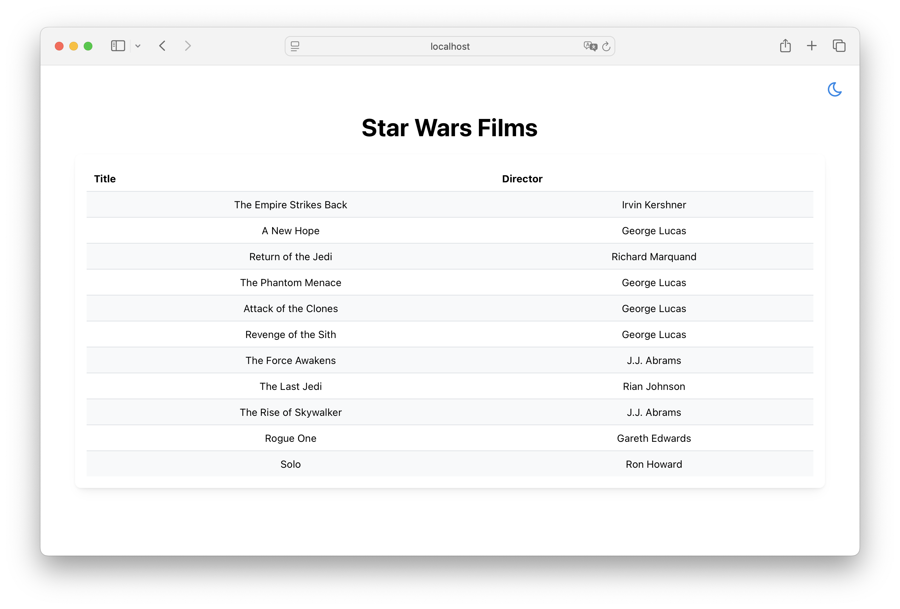

# Overview

This project demonstrates a Web project of React frontend + Python backend communicating via GraphQL

In this example, the frontend renders a Star War film list provided in [`api/main.py`](api/main.py)



## frontend

[`frontend`](frontend/) is a React + Relay + TypeScript project template

## api

[`api`](api/) is a python + FastAPI + Strawberry GraphQL server template

# How to hack this project

## Prerequisites

### Install Package Managers

1. **Backend (uv)**:
   ```bash
   # Windows
   powershell -c "irm https://astral.sh/uv/install.ps1 | iex"
   
   # macOS/Linux
   curl -LsSf https://astral.sh/uv/install.sh | sh
   
   # or via pip
   pip install uv
   ```

2. **Frontend (pnpm)**:
   ```bash
   # Windows
   powershell -c "irm https://get.pnpm.io/install.ps1 | iex"
   
   # macOS/Linux
   curl -fsSL https://get.pnpm.io/install.sh | sh -
   
   # or via npm
   npm install -g pnpm
   ```

### Install Dependencies

1. **Backend Dependencies**:
   ```bash
   cd api
   uv sync
   ```

2. **Frontend Dependencies** (includes Relay and all dev dependencies):
   ```bash
   cd frontend
   pnpm install
   ```

## Develop Environment

### Syncing GraphQL schema

```bash
# to get the GQL schema (run under api/)
cd api
uv sync  # First time only: install dependencies
uv run strawberry export-schema main > ../frontend/src/graphql_schema/local_schema.graphql

# then run this under frontend to generate Relay artifacts
cd ../frontend
pnpm relay
```

### Starting Development Environment

1. **Start Backend API**:
   ```bash
   cd api
   uv run uvicorn main:app --reload --port 9000
   ```

2. **Start Frontend Dev Server**:
   ```bash
   cd frontend
   pnpm dev
   ```

### Access URLs

- **Frontend Dev Server**: http://localhost:5173
- **Backend API**: http://localhost:9000/graphql

### Hot Reload Features

✅ **Frontend Hot Reload**: Changes to files under `frontend/src/` automatically refresh the browser
✅ **Backend Hot Reload**: Changes to files under `api/` automatically restart uvicorn
✅ **API Proxy**: Frontend automatically proxies `/graphql` path to backend API

### Development Workflow

1. Modify frontend code → Browser auto-refreshes
2. Modify backend code → API auto-restarts
3. No need to manually restart any services

## Production Environment

The production environment uses a single port (9000) to serve both frontend and backend.

### Building for Production

1. **Build Frontend**:
   ```bash
   cd frontend
   pnpm build
   ```
   This generates production files in `frontend/dist/` directory.

2. **Start Production Server**:
   ```bash
   cd api
   uv run uvicorn main:app --host 0.0.0.0 --port 9000
   ```

### Access URLs

- **Frontend**: http://localhost:9000/
- **API**: http://localhost:9000/graphql

